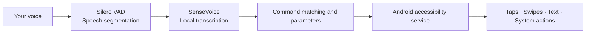

<div align="center">


# YanChuFaSui · 言出法随

### Put tapping, scrolling and typing into words.

An open-source Android tool that turns **spoken Chinese into phone actions**.<br>
Another way to use a phone for people who find touch difficult or want fewer touch interactions.

[](https://github.com/qbhugo666/YanChuFaSui/releases/latest)
[](#get-started)
[](#privacy-and-permissions)
[](LICENSE)

**[Download](https://github.com/qbhugo666/YanChuFaSui/releases/latest)** · **[See it in action](#see-what-your-voice-can-do)** · **[Report an issue](https://github.com/qbhugo666/YanChuFaSui/issues)**

[简体中文](README.md) ｜ English

</div>

---

## Your next tap can start with a sentence

> **「显示编号」 → 「点击十八」**<br>
> “Show numbers” → “Tap eighteen”: label on-screen targets, then select one by number.

Tapping, swiping and typing are part of everyday phone use. When those movements are difficult, browsing, writing a message and switching apps become harder too.

**YanChuFaSui helps people perform these everyday actions themselves, using speech for part of the interaction.**

It uses Android accessibility services to act on the interface you are already using. Speech recognition and command parsing run on the phone, without an account or cloud speech service.

**Commands are currently designed for Chinese.** The English descriptions below explain the actions; they are not an English command pack.

## See what your voice can do

These are existing feature demonstrations. Some interfaces are from earlier versions.

<table>
  <tr>
    <td align="center" width="50%">
      <h3>Select a target by number</h3>
      <p>「显示编号」→「点击十八」</p>
      
    </td>
    <td align="center" width="50%">
      <h3>Keep browsing</h3>
      <p>「向上滑动」 — swipe up</p>
      
    </td>
  </tr>
  <tr>
    <td align="center">
      <h3>Speak text into a field</h3>
      <p>Open a text field →「输入」→ speak</p>
      
    </td>
    <td align="center">
      <h3>Correct words by speaking</h3>
      <p>「把不错替换成很好」</p>
      
    </td>
  </tr>
</table>

## Three ways to reach a target

| Interface | Command | Result |
|---|---|---|
| A target has visible text | 「点击搜索」 | Find and tap the matching text on the current screen |
| Accessibility exposes a target | 「显示编号」→「点击十八」 | Label targets, then select one by number |
| An icon has no text or its position is hard to describe | 「显示网格」→ choose smaller cells →「轻点」 | Narrow the position using a twelve-cell grid, then tap its center |

**The grid remains after a tap**, so you can keep using it. Say 「隐藏」 to hide the overlays.

## Everyday actions

| Capability | Examples |
|---|---|
| Tapping and holding | Text or numbered targets, center tap, double tap, two-step long press |
| Browsing | Four-direction swipes and smaller precise nudges |
| Zooming | Pinch to zoom in or out |
| Text editing | Dictation, deletion, clearing a field, cursor movement, word replacement |
| System controls | Back, home, recent apps, volume, notifications, quick settings, lock screen |
| Screenshot | 「截屏」; Android 9+ required |
| Repetition | 「重复三次」 repeats the previous action; up to ten repetitions |
| Personalization | Custom phrases, personal vocabulary, sensitivity, configuration import/export |

### Keep your own phrases

Choose an action in Settings, record your phrase and save a **custom command**. Custom phrases use the existing homophone and near-sound matching rules. Personal vocabulary helps correct common words in transcribed text.

Export and import your configuration to preserve those phrases and vocabulary when moving devices or sharing a setup.

## A few commands to start with

| Goal | Say |
|---|---|
| Tap a numbered target | 「显示编号」→「点击六」 |
| Reach an unlabeled icon | 「显示网格」→ choose a cell →「轻点」 |
| Long-press a target | 「长按」→「三」 |
| Scroll | 「向上滑动」「向左滑动」 |
| Enter text | Open a text field →「输入」→ speak |
| Replace words | 「把不错替换成很好」 |
| Change volume | 「增加音量」「降低音量」 |
| Navigate | 「返回」「回桌面」「最近任务」 |
| Repeat the previous action | 「重复三次」 |
| End voice control | **「退出」** |

Text tapping targets the **current interface**. Dictation needs a usable text field. Results depend on the interface exposed by the app.

## Get started

**Current release: 0.58.3 · APK about 293 MB · Android 7.0+ · ARM64 / ARMv7**

1. Download and install the APK from **[Releases](https://github.com/qbhugo666/YanChuFaSui/releases/latest)**.
2. Follow the app's instructions to grant microphone permission and enable its accessibility service.
3. Configure battery optimization and background-start permissions as required by your phone.
4. Start voice control and try 「显示编号」.
5. Say 「退出」 when you are finished.

Everyday control runs on the phone. Automatic accessibility recovery on some devices needs one-time ADB authorization from a computer. Ordinary control remains available without that authorization, with manual recovery guidance.

<details>
<summary><strong>Before you install</strong></summary>

- **Why is the APK large?** It includes the offline speech model, so everyday recognition does not require a network service.
- **Can I upgrade in place?** Official releases use the same signing certificate. Debug builds have a different signature and cannot be overwritten directly by a Release build; back up personal configuration before considering removal.
- **Does it work in every app?** Support depends on accessible nodes, editable text fields and gesture handling. Grid targeting can help with some otherwise unreachable targets.
- **Are all features available on Android 7.0+?** Some system actions depend on Android version and manufacturer. Screenshots need Android 9+.
- **Is recognition guaranteed in noise?** No. Accents, background speech, missing word onsets and similar-sounding phrases can cause errors. Conversation can also match a command; start control when needed and say 「退出」 when finished.
- **Does “all dispatched” prove completion?** It confirms that action requests were sent. Check the actual interface for the final effect.

</details>

## Privacy and permissions

**Recognition and command parsing run locally. The app does not request the INTERNET permission.**

- No account or cloud speech service is required; voice control works offline.
- The microphone is used during a control session and released when you say 「退出」.
- Accessibility is used to locate targets, dispatch taps and swipes, edit text and invoke system actions.
- Custom phrases, vocabulary and usage records are stored on the device. Configuration and diagnostic feedback are exported only when you choose to share them; you can inspect their contents first.

Control sessions have timeout protection, and media volume is capped at 80%. The actual interface remains the source of truth for action results.

## Open source, and open to your contribution

If you believe people should have more ways to operate their phones, consider **starring the project** or sharing it with someone who could use it.

[Issues](https://github.com/qbhugo666/YanChuFaSui/issues) and pull requests are welcome. Device model, Android version, intended action and observed result help explain a problem. Private conversations and recordings do not need to be posted.

**[Changelog](CHANGELOG.md)** · **[Milestones](MILESTONES.md)** · **[Command table](app/src/main/assets/commands.json)**

<details>
<summary><strong>Developers: architecture, models and build</strong></summary>

### From speech to action



Version 0.58.3 uses the ordinary offline recognition and text-routing path. Experimental acoustic review has been removed. Execution records are associated with the initiating utterance; some actions can observe interface changes, but dispatch is not proof of application-level completion. Taps are not automatically retried.

### Build from source

Requirements: JDK 17, Gradle 8.5 and Android SDK 34. This repository does not include a Gradle Wrapper.

```powershell
git clone https://github.com/qbhugo666/YanChuFaSui.git
cd YanChuFaSui
```

Models are not included in the source repository. Follow the official [SenseVoice download instructions](https://k2-fsa.github.io/sherpa/onnx/sense-voice/pretrained.html) for the int8 model and the [Silero VAD instructions](https://k2-fsa.github.io/sherpa/onnx/vad/silero-vad.html) for the 16 kHz model:

| File in app/src/main/assets/ | Source |
|---|---|
| `sensevoice.int8.onnx` | Rename `model.int8.onnx` from the official int8 model archive |
| `silero_vad.onnx` | The 16 kHz Silero VAD model maintained by k2-fsa |
| `tokens.txt` | Matching SenseVoice token table; included in this repository |
| `commands.json` | Project command table; included in this repository |

After configuring your Android SDK path:

```powershell
gradle :app:testDebugUnitTest :app:verifySpeechPackage --max-workers=1
```

The Debug APK is written to `app/build/outputs/apk/debug/app-debug.apk`. Release builds use `assembleRelease` and `verifySpeechReleasePackage`, with your own signing configuration. Signing keys are not included. Tests for unpublished local experiments skip only their respective experiments when fixtures are unavailable.

</details>

## Credits and license

Built with [sherpa-onnx](https://github.com/k2-fsa/sherpa-onnx), [SenseVoice](https://github.com/FunAudioLLM/SenseVoice), [Silero VAD](https://github.com/snakers4/silero-vad) and [pinyin4j](https://github.com/belerweb/pinyin4j).

[Apache-2.0](LICENSE) © 2026 黄信豪 (Hugo)
